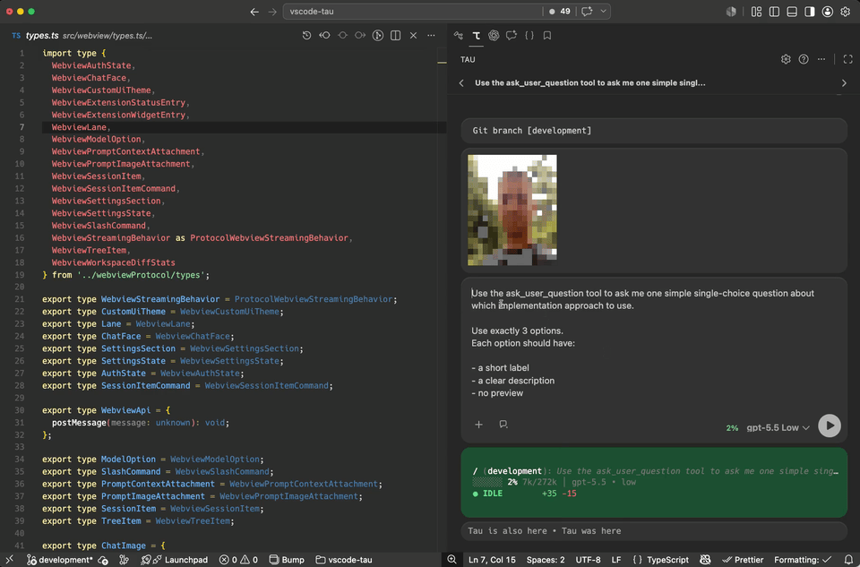
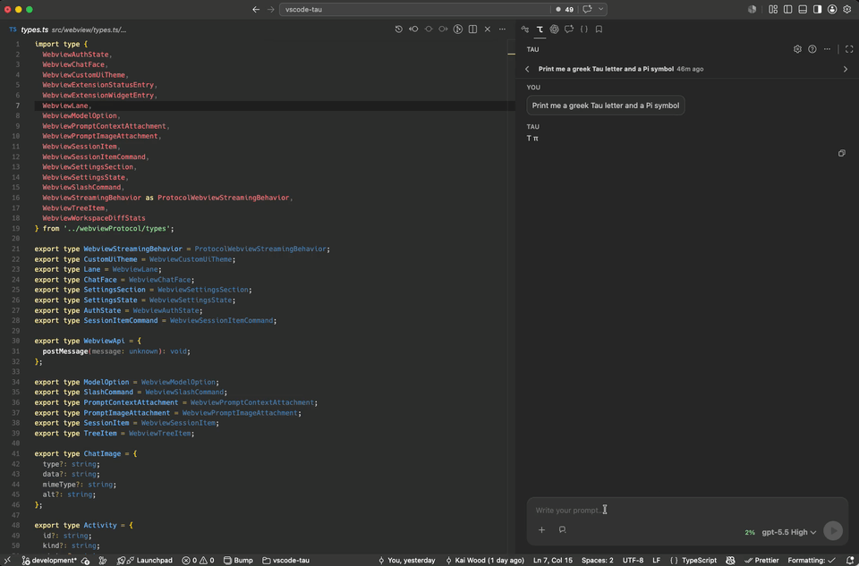

# Tau

Tau is a transparent AI coding assistant for VS Code focused on session-based workflows, code traceability and customizability.

## Philosophy

Tau follows the same direction as [Pi](https://pi.dev), the backend agent engine it builds on:

- full insight into every tool call
- no hidden prompts
- no black magic

If your clanker followed Order 66 again, Tau will at least show you exactly what happened.

## Features

### Trace Origin & Session Diffs

Jump from code back to the historical agent session that created it.

Tau can reconnect:

- current code
- historical agent context
- related Git commits
- reasoning history

Even across refactors and file moves.

From there, session diffs make it easy to inspect exactly what changed during the session.


### Customization via Pi extensions

Aiming to stay on par with everything the ecosystem supports. Today it has:

- Widgets, above and below the prompt
- Status lines
- Themeable Custom UI overlays to support questionnaire plugins and the like
- All fully aware of ANSI escape sequences and the Kitty protocol
- Support for TUI-image rendering and other quirks



### What else?

Tau builds on top of the Pi engine's existing capabilities:

- Tree-based session management
- Resumable sessions
- Transparent tool execution

In addition, it brings to the table:

- A keyboard-centric workflow
- Parallel / background sessions
- IDE context
- File attachments (Drag'n'drop, Copy&Paste, Mouse'n'Click)
- Guardrails to restrict the agent to the workspace, if that's your thing

### Can it run Doom?

You bet! And because Τ=2\*π, it runs it twice:



## Requirements / Setup

Setup Pi the standard way, if you don't already have:

```sh
npm install -g @earendil-works/pi-coding-agent
pi
/login
```

For more information, read the [documentation here](https://pi.dev/docs/latest).

Or, as of v2: Skip that part, Tau also got you covered on the OAuth / API Key front. Just click on the settings gear, you might be surprised what else you will find there.

## Using Tau

Tau is heavily keyboard-oriented. I recommend: Play around with the `Esc`-key.

Everything else is mostly discoverable. You'll figure out the rest anyway, but the help icon for keybindings might be worth a visit.

## Development

```sh
npm install
npm run compile
```

Run tests with:

```sh
npm test
```

For local development in VS Code, launch the extension host from the provided VS Code launch configuration.

## License

MIT
